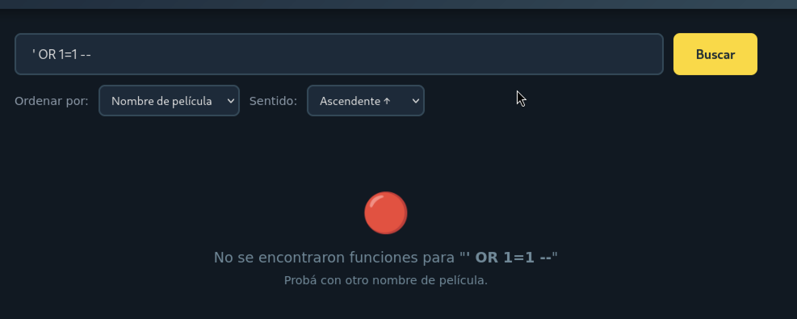

# Práctico 2 — Mitigación de Vulnerabilidades de CWE

**Autor:** Lucas Cordero
**Ramas:** `main` (código vulnerable, sin modificar) / `practico-2` (mitigaciones)
**Ambiente:** cada ejercicio se levanta de forma independiente con `docker-compose up` desde su propia carpeta (`Ejercicio1` a `Ejercicio5`).

Este informe detalla, para cada ejercicio: dónde está la vulnerabilidad, una prueba de concepto (PoC) paso a paso para explotarla sobre el código de `main`, el impacto, y la mitigación aplicada en `practico-2`.

---

## Objetivo

El objetivo de este práctico fue, para cada una de las cinco vulnerabilidades: entender cómo se explota en la práctica (no solo en teoría), reconocer cómo ese mismo tipo de error aparece en aplicaciones reales (son errores comunes, no particularidades de este código de ejemplo), y aplicar la corrección correspondiente para prevenirlo y evitar que se repita en desarrollos futuros.

---

## Ejercicio 1 — Inyección SQL (SQLi)

- **CWE:** CWE-89 (SQL Injection)
- **Dónde:** `Ejercicio1/app.py`, función `buscar_funciones()`, invocada desde la ruta `GET /`.
- **Servicio:** `docker-compose up` desde `Ejercicio1/` → `http://localhost:5000/`

### Código vulnerable

```python
def buscar_funciones(query, sort_by='nombre', sort_dir='ASC'):
    db = get_db()
    sql = f"SELECT peliculas.nombre as pelicula, funciones.fecha_hora, " \
          f"(funciones.asientos_totales - funciones.asientos_ocupados) as disponibles " \
          f"FROM funciones " \
          f"JOIN peliculas ON funciones.pelicula_id = peliculas.id " \
          f"WHERE peliculas.nombre LIKE '%{query}%' " \
          f"ORDER BY {'peliculas.nombre' if sort_by == 'nombre' else 'funciones.fecha_hora'} " \
          f"{sort_dir}"
    return db.execute(sql).fetchall()
```

El parámetro `buscar` (querystring de `GET /`) se concatena directamente dentro de la sentencia SQL, sin escapar ni parametrizar.

### PoC 1 — Bypass del filtro de búsqueda (obtener todos los registros)

1. Levantar el servicio (`docker-compose up` en `Ejercicio1/`).
2. Ir al navegador (o `curl`) a:

   ```
   http://localhost:5000/?buscar=' OR '1'='1
   ```

   URL-encoded:

   ```
   curl "http://localhost:5000/?buscar=%27%20OR%20%271%27%3D%271"
   ```

3. La consulta resultante en el servidor queda:

   ```sql
   ... WHERE peliculas.nombre LIKE '%' OR '1'='1%' ORDER BY peliculas.nombre ASC
   ```

   La condición `'1'='1'` es siempre verdadera, por lo que la cláusula `WHERE` deja de filtrar y **se devuelven todas las funciones de todas las películas**, sin importar el texto buscado.

**Captura sugerida (`ej1_poc1_bypass.png`):** navegador o `curl -v` mostrando la URL con el payload y la respuesta con el listado completo de películas/funciones (dejar visible la barra de direcciones o el comando `curl` usado, y la tabla de resultados).


### PoC 2 — Exfiltración de datos vía `UNION SELECT` (extraer el esquema de la base)

El `SELECT` vulnerable devuelve 3 columnas (`pelicula`, `fecha_hora`, `disponibles`), lo que permite inyectar un `UNION SELECT` con el mismo número de columnas para leer cualquier tabla de la base, no solo `peliculas`/`funciones`.

1. Ingresar como valor de `buscar`:

   ```
   %' UNION SELECT name, sql, 1 FROM sqlite_master --
   ```

   Request completo:

   ```
   http://localhost:5000/?buscar=%25%27%20UNION%20SELECT%20name%2C%20sql%2C%201%20FROM%20sqlite_master%20--
   ```

2. La consulta resultante:

   ```sql
   ... WHERE peliculas.nombre LIKE '%%' UNION SELECT name, sql, 1 FROM sqlite_master -- %' ORDER BY ...
   ```

   El `--` comenta el resto de la sentencia (incluido el `ORDER BY` original), y el `UNION SELECT` agrega como resultados el nombre y el DDL (`CREATE TABLE ...`) de cada tabla de la base, mostrando el esquema completo sin tener ningún permiso ni credencial. El mismo mecanismo permite reemplazar `sqlite_master` por cualquier otra tabla de la base (por ejemplo, credenciales, si existieran) para exfiltrar sus datos.

**Captura sugerida (`ej1_poc2_union_schema.png`):** respuesta de la aplicación mostrando, en las columnas "película"/"fecha_hora", el nombre y el `CREATE TABLE` de las tablas internas (evidencia de que se filtró el esquema de la base y no solo películas).


### Impacto

Lectura no autorizada de cualquier dato de la base (bypass de filtros, exfiltración de tablas completas, mapeo del esquema); en un motor con soporte de sentencias apiladas también podría derivar en modificación o borrado de datos.

### Mitigación aplicada (`practico-2`)

Se reemplazó la concatenación de `query` por una **consulta parametrizada**, usando `?` como placeholder y pasando el valor por separado al driver:

```python
sql = f"SELECT peliculas.nombre as pelicula, funciones.fecha_hora, " \
      f"(funciones.asientos_totales - funciones.asientos_ocupados) as disponibles " \
      f"FROM funciones " \
      f"JOIN peliculas ON funciones.pelicula_id = peliculas.id " \
      f"WHERE peliculas.nombre LIKE ? " \
      f"ORDER BY {'peliculas.nombre' if sort_by == 'nombre' else 'funciones.fecha_hora'} " \
      f"{sort_dir}"
return db.execute(sql, (f'%{query}%',)).fetchall()
```

`sqlite3` trata el valor pasado en la tupla como un **dato literal**, nunca como código SQL, por lo que `' OR '1'='1` y el `UNION SELECT` dejan de tener efecto: se buscan literalmente como texto dentro del nombre de la película (sin resultados).

`sort_by` ya estaba (y sigue estando) protegido mediante una whitelist explícita (el operador ternario solo admite `'peliculas.nombre'` o `'funciones.fecha_hora'`), por lo que no es inyectable.

**Captura sugerida (`ej1_mitigado.png`):** repetición de la PoC 1 (`' OR '1'='1`) contra el código de `practico-2`, mostrando que ahora no devuelve resultados (la cadena se busca literalmente como texto).



> **Nota / hallazgo adicional (no forma parte del punto pedido, queda como observación):** el parámetro `sentido` (`sort_dir`) se sigue insertando sin validar directamente en la cláusula `ORDER BY`. No es explotable para exfiltrar datos por esta vía tan directamente como `buscar` (SQLite no permite múltiples sentencias en `execute()`), pero sí permite inyectar expresiones dentro del `ORDER BY` (p. ej. subconsultas condicionales) para una inyección ciega booleana. Si se quiere cerrar por completo, se recomienda aplicar la misma whitelist que ya existe para `sort_by` (aceptar únicamente `"ASC"`/`"DESC"`, cualquier otro valor cae a un default seguro).

---

## Ejercicio 2 — Cross-Site Scripting (XSS)

- **CWE:** CWE-79 (Stored/Persistent XSS)
- **Dónde:** `Ejercicio2/templates/edit.html`, al renderizar la descripción de la película.
- **Servicio:** `docker-compose up` desde `Ejercicio2/` → `http://localhost:5000/`

### Código vulnerable

```html
<div class="prev-descripcion">
    <strong>Descripción actual:</strong><br>
    {{ pelicula['descripcion'] | safe }}
</div>
```

El filtro `| safe` de Jinja2 le indica al motor de templates que **no** escape el contenido de `descripcion`, tratándolo como HTML/JS ya confiable, cuando en realidad proviene de un campo editable por el usuario.

### PoC — Stored XSS

1. Levantar el servicio y entrar a `http://localhost:5000/`, buscar una película (por ejemplo `Dune`) para obtener su `id`, o ir directo a `http://localhost:5000/edit/1`.
2. En el formulario de edición (`GET /edit/<id>`), completar el campo **Descripción** con:

   ```html
   <script>alert('XSS')</script>
   ```

   **Captura sugerida (`ej2_poc_payload_ingresado.png`):** formulario de edición con el payload escrito en el campo Descripción, antes de enviar.


3. Enviar el formulario (`POST /edit/<id>`), que guarda el valor tal cual en la base de datos (`UPDATE peliculas SET ... descripcion=? ...`, ya parametrizado — el problema no es al guardar sino al mostrar).
4. Volver a entrar a `GET /edit/<id>` (por ejemplo, recargando la página o volviendo a hacer clic en "Editar" sobre esa película). Al renderizar `edit.html`, el bloque `{{ pelicula['descripcion'] | safe }}` inyecta el `<script>` tal cual en el HTML de la respuesta y el navegador lo ejecuta, mostrando el `alert('XSS')`.
5. Cualquier otro usuario (o administrador) que abra la página de edición de esa misma película ejecuta el script sin haberlo escrito él mismo — de ahí que sea **XSS persistente/almacenado**: el payload queda guardado en la base y se dispara cada vez que alguien visita esa vista.

**Captura sugerida (`ej2_poc_alert_disparado.png`):** el popup de `alert('XSS')` disparándose en el navegador al volver a cargar `GET /edit/<id>` (idealmente en una segunda visita/recarga, para dejar claro que el script se ejecuta solo, sin volver a escribirlo).


Un payload más dañino que un `alert()` podría robar la cookie de sesión (`document.cookie`) y enviarla a un servidor externo, o realizar acciones en nombre del usuario que visualiza la página (por ejemplo, enviar el propio formulario de edición con datos manipulados).

### Impacto

Ejecución de JavaScript arbitrario en el navegador de cualquier usuario que visualice la ficha de edición de la película afectada: robo de sesión/cookies, phishing dentro del sitio, acciones no autorizadas en nombre de la víctima.

### Mitigación aplicada (`practico-2`)

Se eliminó el filtro `| safe`:

```html
<div class="prev-descripcion">
    <strong>Descripción actual:</strong><br>
    {{ pelicula['descripcion'] }}
</div>
```

Sin `| safe`, Jinja2 aplica el autoescape por defecto y convierte `<`, `>`, `&`, comillas, etc. en sus entidades HTML (`&lt;script&gt;...`), por lo que el navegador muestra el texto tal cual fue escrito en lugar de interpretarlo como marcado/script.

**Captura sugerida (`ej2_mitigado.png`):** repetición de la PoC contra `practico-2` — la página de edición mostrando el texto literal `<script>alert('XSS')</script>` (sin ejecutarse) y, opcionalmente, el HTML fuente de la respuesta (`Ver código fuente` del navegador o `curl`) evidenciando las entidades `&lt;`/`&gt;`.


> **Nota / hallazgo adicional (fuera del alcance de este ejercicio, queda como observación):** el archivo `Ejercicio2/app.py` incluye una copia de `buscar_funciones()` con la misma inyección SQL del Ejercicio 1 (`WHERE peliculas.nombre LIKE '%{query}%'`), que **no fue parametrizada** en esta rama porque no es el objetivo de este ejercicio (que es XSS). Se deja documentado por si se quiere aplicar la misma corrección del Ejercicio 1 por consistencia.

---

## Ejercicio 3 — File Upload inseguro

- **CWE:** CWE-434 (Unrestricted Upload of File with Dangerous Type)
- **Dónde:** `Ejercicio3/.../controller/PeliculaController.java`, método `uploadFile()` (`POST /upload/{id}`).
- **Servicio:** `docker-compose up` desde `Ejercicio3/` → `http://localhost:8080/`

### Código vulnerable

```java
@PostMapping("/upload/{id}")
public String uploadFile(@PathVariable Integer id,
                         @RequestParam("afiche") MultipartFile archivo) throws IOException {
    Pelicula pelicula = peliculaRepo.findById(id)
        .orElseThrow(() -> new EntityNotFoundException("Pelicula no encontrada"));

    String filename = archivo.getOriginalFilename();
    Path uploadPath = Paths.get(uploadDir);
    if (!Files.exists(uploadPath)) {
        Files.createDirectories(uploadPath);
    }
    Files.copy(archivo.getInputStream(), uploadPath.resolve(filename));

    pelicula.setAfichePath(filename);
    peliculaRepo.save(pelicula);

    return "redirect:/";
}
```

No se valida el contenido real del archivo, ni su tipo MIME, ni su extensión, ni su tamaño; y se guarda directamente con el nombre original enviado por el cliente (lo que además habilita un *path traversal* si el nombre incluye `../`).

### PoC — Subir un archivo que no es una imagen, haciéndolo pasar como `.jpg`

1. Levantar el servicio y crear un archivo de texto cualquiera:

   ```bash
   echo "esto no es una imagen, es texto plano" > payload.txt
   cp payload.txt afiche_falso.jpg
   ```

2. Ir a `http://localhost:8080/upload/1` (formulario de subida de afiche para la película con `id=1`), o directamente por `curl`:

   ```bash
   curl -F "afiche=@afiche_falso.jpg;type=image/jpeg" http://localhost:8080/upload/1
   ```

3. La aplicación acepta el archivo sin verificar su contenido real y lo guarda en el directorio de uploads con el nombre original (`afiche_falso.jpg`), asociándolo como afiche válido de la película.

   **Captura sugerida (`ej3_poc_upload_aceptado.png`):** respuesta del `curl` (o la pantalla luego del submit del formulario) mostrando el `redirect:/` / código `200`, evidenciando que el servidor aceptó el archivo de texto como si fuera una imagen válida.


4. Se puede confirmar accediendo a `http://localhost:8080/uploads/afiche_falso.jpg`: el servidor sirve el contenido de texto plano como si fuera un afiche.

   **Captura sugerida (`ej3_poc_archivo_servido.png`):** el navegador (o `curl -i`) mostrando que `/uploads/afiche_falso.jpg` devuelve el texto plano del archivo (no una imagen), o el ícono de "imagen rota" si se accede desde el `` de la ficha de la película — evidencia de que un archivo no-imagen quedó publicado como afiche.


Con la misma técnica se podría subir, por ejemplo, un archivo `.jsp`/`.html`/`.svg` renombrado con extensión de imagen (o incluso sin cambiar nada si el filtro solo mira el `Content-Type` declarado por el cliente, que es trivial de falsificar), abriendo la puerta a XSS almacenado (si se sirve `.html`/`.svg` con contenido interpretado por el navegador) o, en configuraciones más permisivas del servidor, a ejecución remota de código si el archivo cae dentro de un directorio servido como código ejecutable.

### Impacto

Subida de archivos maliciosos disfrazados de imágenes: XSS almacenado, degradación del servicio (archivos de tamaño arbitrario), y en escenarios más graves, ejecución remota de código si el archivo llega a ejecutarse en el servidor.

### Mitigación aplicada (`practico-2`)

En `PeliculaController.uploadFile()` se agregaron varias capas de validación server-side:

1. **Tamaño máximo:** se rechaza si `archivo.getSize()` supera 5 MB, y además se configuró el límite a nivel de Spring (`application.properties`):

   ```properties
   spring.servlet.multipart.max-file-size=5MB
   spring.servlet.multipart.max-request-size=5MB
   ```

2. **Extensión permitida (whitelist):** solo se aceptan `jpg`, `jpeg`, `png`, `webp` (obtenidas del nombre original, únicamente para leer la extensión, nunca para guardar el archivo con ese nombre).
3. **Tipo MIME declarado:** se valida contra una whitelist (`image/jpeg`, `image/png`, `image/webp`). Esta capa por sí sola es insuficiente (el cliente puede mentir), pero suma defensa en profundidad.
4. **Validación real del contenido (la mitigación central):** se intenta decodificar el archivo con `ImageIO.read(...)`. Si el resultado es `null`, el archivo no es una imagen válida (sin importar su extensión o `Content-Type`) y se rechaza con `400 Bad Request`. Esto es lo que efectivamente detecta el `.txt` renombrado a `.jpg` de la PoC, porque `ImageIO` lee los *magic bytes* del archivo, no su nombre.
5. **Nombre de archivo seguro:** el afiche ya **no** se guarda con `archivo.getOriginalFilename()`. Se genera un nombre nuevo con `UUID.randomUUID() + "." + extensión`, eliminando tanto el riesgo de *path traversal* (`../../etc/...`) como la posibilidad de sobrescribir archivos de otros usuarios.

```java
if (archivo.getSize() > TAMANIO_MAXIMO_BYTES) { ... }
if (extension == null || !EXTENSIONES_PERMITIDAS.contains(extension.toLowerCase())) { ... }
if (contentType == null || !MIME_PERMITIDOS.contains(contentType.toLowerCase())) { ... }
BufferedImage imagen;
try (InputStream in = archivo.getInputStream()) {
    imagen = ImageIO.read(in);
}
if (imagen == null) { ... }
String nombreSeguro = UUID.randomUUID() + "." + extension.toLowerCase();
Files.copy(archivo.getInputStream(), uploadPath.resolve(nombreSeguro));
```

Repitiendo la PoC contra `practico-2`, la subida de `afiche_falso.jpg` (contenido de texto plano) responde `400 Bad Request` ("El archivo no es una imagen válida") y no se guarda ningún archivo.

**Captura sugerida (`ej3_mitigado.png`):** respuesta `400 Bad Request` con el mensaje "El archivo no es una imagen válida" al repetir la PoC contra `practico-2`, y opcionalmente el directorio de uploads mostrando que no se creó ningún archivo nuevo.


> El atributo `accept="image/jpeg,image/png,image/webp"` agregado en `upload.html` es solo una ayuda de UX en el navegador (evitable por cualquier atacante armando el request a mano, como en la PoC); la protección real está en el servidor.

---

## Ejercicio 4 — Server-Side Template Injection (SSTI)

- **CWE:** CWE-1336 / CWE-917 (Improper Neutralization of Special Elements used in an Expression Language Statement — SpEL Injection)
- **Dónde:** `Ejercicio4/.../config/SpelEvaluator.java`, método `evaluate()`, invocado desde `FuncionController.search()` al procesar el parámetro `buscar` (`GET /`).
- **Servicio:** `docker-compose up` desde `Ejercicio4/` → `http://localhost:8080/`

### Código vulnerable

```java
public String evaluate(String expression) {
    if (expression == null || expression.isBlank()) {
        return "";
    }
    ExpressionParser parser = new SpelExpressionParser();
    StandardEvaluationContext standardContext = new StandardEvaluationContext();
    standardContext.setVariable("system", System.class);
    standardContext.setVariable("runtime", Runtime.class);

    var expr = parser.parseExpression(expression);
    Object result = expr.getValue(standardContext);

    return result != null ? result.toString() : "";
}
```

El texto ingresado en el buscador se pasa tal cual a `SpelExpressionParser.parseExpression(...)` y se evalúa con un `StandardEvaluationContext` (el más permisivo de Spring: permite invocar métodos, acceder a propiedades, usar reflexión y, en este caso, además expone explícitamente las clases `System` y `Runtime` como variables).

### PoC 1 — Confirmar la inyección (cálculo aritmético)

1. Levantar el servicio y entrar a `http://localhost:8080/`.
2. En el campo de búsqueda, ingresar:

   ```
   7 * 7
   ```

3. La aplicación no busca ninguna función cuyo nombre sea literalmente "7 * 7": en cambio, el mensaje resultante muestra `49`, evidenciando que el servidor evaluó la expresión matemática en lugar de tratarla como texto plano.

**Captura sugerida (`ej4_poc1_calculo.png`):** buscador con `7 * 7` ingresado y el mensaje de resultado mostrando `49`.


### PoC 2 — Ejecución de comandos en el servidor (RCE) vía `Runtime`

Como el contexto expone `runtime` (`Runtime.class`) y permite invocar métodos estáticos/reflexión, se puede escalar de una simple evaluación aritmética a ejecución de comandos del sistema operativo:

1. Ingresar en el buscador la siguiente expresión SpEL (URL-encoded si se usa `curl`):

   ```
   T(java.lang.Runtime).getRuntime().exec('id')
   ```

   ```bash
   curl -G "http://localhost:8080/" --data-urlencode "buscar=T(java.lang.Runtime).getRuntime().exec('id')"
   ```

2. SpEL resuelve `T(java.lang.Runtime)` como referencia a la clase `Runtime`, y con `StandardEvaluationContext` se permite invocar `getRuntime().exec(...)`, lanzando el proceso `id` en el servidor. El resultado que se ve en pantalla es el `Process` object (su `toString()`), pero el comando ya se ejecutó del lado del servidor con los permisos del proceso Java — se puede confirmar mirando los logs del contenedor o, para una prueba más contundente, apuntando el comando a escribir un archivo (`exec('touch /tmp/poc_ssti')`) y verificando su existencia dentro del contenedor.

**Captura sugerida (`ej4_poc2_rce.png`):** dos capturas en una: (a) la petición con `T(java.lang.Runtime).getRuntime().exec('touch /tmp/poc_ssti')` enviada al buscador, y (b) una terminal con `docker exec cinebuscador4 ls -la /tmp/poc_ssti` mostrando que el archivo fue creado dentro del contenedor — esta segunda parte es la evidencia real de RCE (la primera por sí sola solo muestra el `Process` object en pantalla).


### Impacto

Ejecución remota de código (RCE) en el servidor con los permisos del proceso de la aplicación: lectura/escritura de archivos, exfiltración de variables de entorno y credenciales, pivoteo dentro de la red del contenedor, denegación de servicio.

### Mitigación aplicada (`practico-2`)

La funcionalidad de búsqueda **no necesita evaluar expresiones**: solo necesita comparar el texto ingresado contra el nombre de la función (`contains`). Por lo tanto, la mitigación es dejar de interpretar el input del usuario como código: se eliminó por completo el uso de `SpelExpressionParser`/`StandardEvaluationContext` sobre datos no confiables.

```java
public String evaluate(String expression) {
    if (expression == null || expression.isBlank()) {
        return "";
    }
    return expression.trim();
}
```

Repitiendo la PoC 1 contra `practico-2`, el buscador con `7 * 7` ya no devuelve `49`: busca literalmente funciones cuyo nombre contenga el texto `"7 * 7"` (sin resultados), y la PoC 2 (`T(java.lang.Runtime)...`) tampoco ejecuta ningún proceso: se trata como una cadena de búsqueda más.

**Captura sugerida (`ej4_mitigado.png`):** buscador con `7 * 7` contra `practico-2`, mostrando que el mensaje ahora dice algo como "buscando por: 7 * 7" (texto literal) y no `49`.


Se documenta además en el propio código que, si en el futuro se necesitara evaluar expresiones dinámicas reales, debe usarse `SimpleEvaluationContext` (que no permite invocar constructores arbitrarios ni acceder a tipos vía reflexión) en lugar de `StandardEvaluationContext`, y nunca construir la expresión a evaluar a partir de input de usuario sin una whitelist estricta de expresiones permitidas.

---

## Ejercicio 5 — Almacenamiento inseguro de contraseñas

- **CWE:** CWE-321 (Use of Hard-coded Cryptographic Key) + CWE-257 / CWE-326 (Storing Passwords in a Recoverable/Reversible Format)
- **Dónde:** `Ejercicio5/.../controller/AuthController.java` y `Ejercicio5/.../config/EncryptionService.java`, al registrar (`POST /register`) e iniciar sesión (`POST /login`).
- **Servicio:** `docker-compose up` desde `Ejercicio5/` → `http://localhost:8080/`

### Código vulnerable

```java
// EncryptionService.java
private static final String SECRET_KEY = "MySup3rS3cr3tK3y!2024CineBuscadorAES";
private static final String CIPHER_ALGO = "AES/ECB/PKCS5Padding";

public static String encrypt(String plaintext) { ... } // AES/ECB con clave fija
public static String decrypt(String encryptedBase64) { ... }

// AuthController.java
nuevoUsuario.setPassword(EncryptionService.encrypt(password));   // registro
String decryptedPassword = EncryptionService.decrypt(user.getPassword()); // login
```

Las contraseñas no se hashean: se **cifran de forma reversible** con AES en modo ECB, usando una clave simétrica **fija y escrita en el código fuente**. Cualquiera con acceso al código (o al binario/JAR compilado) puede descifrar cualquier contraseña almacenada en la base, sin necesidad de romper ningún hash.

### PoC — Recuperar la contraseña en texto plano a partir de la base de datos

1. Levantar el servicio y registrar un usuario de prueba desde `http://localhost:8080/` (formulario de registro), por ejemplo `usuario=poc_user`, `password=SuperSecreta123`.
2. La aplicación guarda en la tabla `usuarios` el valor de `EncryptionService.encrypt("SuperSecreta123")`, un Base64 como por ejemplo `Q2FudGlkYWQgZGUgZWplbXBsbw==` (el valor real se puede ver en pantalla, ya que `AuthController` lo expone en `model.addAttribute("encryptedPassword", ...)`, o consultando directamente la base H2).

   **Captura sugerida (`ej5_poc_password_cifrada.png`):** pantalla de registro exitoso mostrando el valor Base64 de la contraseña "cifrada" (`encryptedPassword`), o la consola H2 (`http://localhost:8080/h2-console`, si está habilitada) mostrando el contenido de la tabla `usuarios`.


3. Como la clave `MySup3rS3cr3tK3y!2024CineBuscadorAES` está fija en el código fuente (visible para cualquiera con acceso al repositorio, o recuperable del `.jar` compilado con un decompilador), un atacante puede descifrar ese valor **sin necesidad de acceder a la aplicación en ejecución**, por ejemplo reutilizando el propio método `decrypt`, o replicando el cifrado con OpenSSL:

   ```bash
   # Clave en hexadecimal (32 bytes, AES-256), derivada de la constante del código:
   echo -n "MySup3rS3cr3tK3y!2024CineBuscadorAES" | head -c 32 | xxd -p | tr -d '\n'

   # Descifrado del valor guardado en la base (ECB, sin IV):
   echo "Q2FudGlkYWQgZGUgZWplbXBsbw==" | base64 -d | \
     openssl enc -d -aes-256-ecb -K <CLAVE_HEX> -nopad
   ```

4. El resultado es la contraseña original en texto plano (`SuperSecreta123`), recuperada exclusivamente a partir del volcado de la base de datos y del código fuente (o del `.jar`), sin haber comprometido nunca la sesión del usuario ni intentado un ataque de fuerza bruta.

   **Captura sugerida (`ej5_poc_password_descifrada.png`):** terminal mostrando el comando `openssl` y su salida con `SuperSecreta123` en texto plano, junto al valor cifrado del paso anterior, para dejar en evidencia la correspondencia.


Como agravante, al usar **ECB sin IV**, dos usuarios con la misma contraseña producen exactamente el mismo texto cifrado, lo que permite a un atacante con solo acceso a la base de datos (sin la clave) detectar contraseñas repetidas entre cuentas por simple comparación de los valores almacenados.

### Impacto

Compromiso total de las credenciales de todos los usuarios ante una filtración del código fuente o de la base de datos (no se requiere quebrar ningún algoritmo, solo leer una constante), habilitando *account takeover* masivo y reutilización de credenciales en otros servicios (dado que muchos usuarios reutilizan contraseñas).

### Mitigación aplicada (`practico-2`)

Se eliminó por completo el cifrado reversible: se quitó el archivo `EncryptionService.java` y se reemplazó por **hashing con BCrypt** (`spring-security-crypto`), que es unidireccional (no reversible) e incluye salt aleatorio por contraseña:

```java
private final BCryptPasswordEncoder passwordEncoder = new BCryptPasswordEncoder();

// Registro
nuevoUsuario.setPassword(passwordEncoder.encode(password));

// Login
if (passwordEncoder.matches(password, user.getPassword())) { ... }
```

Se agregó la dependencia correspondiente en `pom.xml`:

```xml
<dependency>
    <groupId>org.springframework.security</groupId>
    <artifactId>spring-security-crypto</artifactId>
</dependency>
```

Con este cambio: (a) no existe ninguna clave que filtrar — no hay forma de "descifrar" un hash BCrypt; (b) cada hash incluye su propio salt, por lo que dos usuarios con la misma contraseña obtienen valores almacenados distintos; y (c) el login sigue funcionando porque `matches()` verifica la contraseña ingresada contra el hash sin necesidad de recuperar el valor original. Repitiendo la PoC contra `practico-2`, el valor guardado en la base es un hash BCrypt (`$2a$10$...`) y no existe ningún procedimiento (ni con la clave del código viejo, que ya no existe) para recuperar la contraseña en texto plano a partir de él.

**Captura sugerida (`ej5_mitigado.png`):** registro del mismo usuario de prueba contra `practico-2`, mostrando el hash BCrypt (`$2a$10$...`) guardado en lugar del Base64 reversible, y opcionalmente un login exitoso posterior para demostrar que la verificación sigue funcionando.


---

## Anexo — Listado de capturas a incluir

Cada captura se referencia inline en su sección correspondiente con ``, junto a un breve texto (`**Captura sugerida (archivo.png):** ...`) que indica qué debe mostrarse. Este listado es solo un resumen de referencia rápida antes de entregar:

| Archivo | Ejercicio | Qué debe mostrar |
|---|---|---|
| `ej1_poc1_bypass.png` | 1 — SQLi | Request con `' OR '1'='1` y la respuesta con todas las películas |
| `ej1_poc2_union_schema.png` | 1 — SQLi | Resultado del `UNION SELECT` mostrando el esquema (`sqlite_master`) |
| `ej1_mitigado.png` | 1 — SQLi | Misma PoC contra `practico-2`, sin resultados |
| `ej2_poc_payload_ingresado.png` | 2 — XSS | Formulario de edición con el `<script>` escrito, antes de guardar |
| `ej2_poc_alert_disparado.png` | 2 — XSS | El `alert('XSS')` disparándose al recargar la edición |
| `ej2_mitigado.png` | 2 — XSS | Texto del script mostrado literalmente (escapado), sin ejecutarse |
| `ej3_poc_upload_aceptado.png` | 3 — File Upload | El `.txt` renombrado a `.jpg` aceptado por el servidor |
| `ej3_poc_archivo_servido.png` | 3 — File Upload | `/uploads/afiche_falso.jpg` sirviendo texto plano, no una imagen |
| `ej3_mitigado.png` | 3 — File Upload | `400 Bad Request` al repetir la subida contra `practico-2` |
| `ej4_poc1_calculo.png` | 4 — SSTI | Búsqueda `7 * 7` devolviendo `49` |
| `ej4_poc2_rce.png` | 4 — SSTI | Payload `Runtime.exec(...)` + evidencia del archivo creado dentro del contenedor |
| `ej4_mitigado.png` | 4 — SSTI | Búsqueda `7 * 7` tratada como texto literal en `practico-2` |
| `ej5_poc_password_cifrada.png` | 5 — Almacenamiento inseguro | Contraseña guardada en Base64 (AES/ECB reversible) |
| `ej5_poc_password_descifrada.png` | 5 — Almacenamiento inseguro | Descifrado por `openssl` mostrando la contraseña en texto plano |
| `ej5_mitigado.png` | 5 — Almacenamiento inseguro | Hash BCrypt guardado en `practico-2`, y login funcionando |

---

## Resumen

| # | Vulnerabilidad | CWE | Estado en `practico-2` |
|---|---|---|---|
| 1 | SQL Injection | CWE-89 | Mitigado (consulta parametrizada) |
| 2 | XSS almacenado | CWE-79 | Mitigado (se removió `\| safe`) |
| 3 | File Upload inseguro | CWE-434 | Mitigado (validación de contenido real + whitelist + tamaño + nombre seguro) |
| 4 | SSTI (SpEL Injection) | CWE-1336/917 | Mitigado (se eliminó la evaluación de expresiones sobre input de usuario) |
| 5 | Almacenamiento inseguro de contraseñas | CWE-321/257 | Mitigado (BCrypt, se removió el cifrado reversible y la clave estática) |
